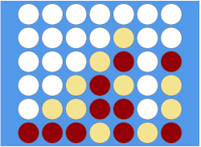

# Filotto



A simple web game that mimics [Connect Four](https://en.wikipedia.org/wiki/Connect_Four)
that uses [Edd Wise](https://github.com/exelr/eddwise) code generation tools.

## Run the game

If you have `go` >= 1.16, start the server directly:
```shell
go run github.com/exelr/filotto/cmd/service -w 8080 -s 3000
```

Otherwise you can use Docker:

```shell
docker build . -t filotto
docker run -p8080:8080 -p3000:3000 filotto
```

Open in a browser [http://localhost:8080](http://localhost:8080) in a browser, and play against yourself!

If you want to play against a remote player, consider expose your machine with tools like `ngrok` and share the url with them.

## How it works

Starting with the [design](/design/filotto.edd.go) of the events, we define:

- A channel `Filotto` on which we enable all the structures that are also event messages
- `Welcome` structure that is the message that the server send to any new connected client
- `QueueRequest` structure that is the request from a player to be queued for a match (done automatically on first connection by javascript)
- `MatchStarts` structure that is sent from server when two player can start their match to both players.
- `MatchEnds` structure that is sent from server to both player in a match to communicate the result of the match (or in case of socket communication drop of one of the player)
- `PlayerMove` structure that is sent from client to server and then relayed to other player when the first player pick a move

Players can move iff they are in a match, the turn is their and the move is in a valid column (<= total columns and not in already full column)

Queue is actually implemented as a `list.List` but due to the simple nature of the match it can be also implemented as a single variable that is the only waiting player.

The full implementation is in [filotto.go](/filotto.go)

## Improvements

If you want to experiment with the events, some improvements can be done.
Actually the name of the player is missing from the UI, you can integrate it.
You can also implement the ability for players to change their names (you would need a new event!).

Also, the UI is very basic and without any js framework (I had to use jQuery for primitive animations).
